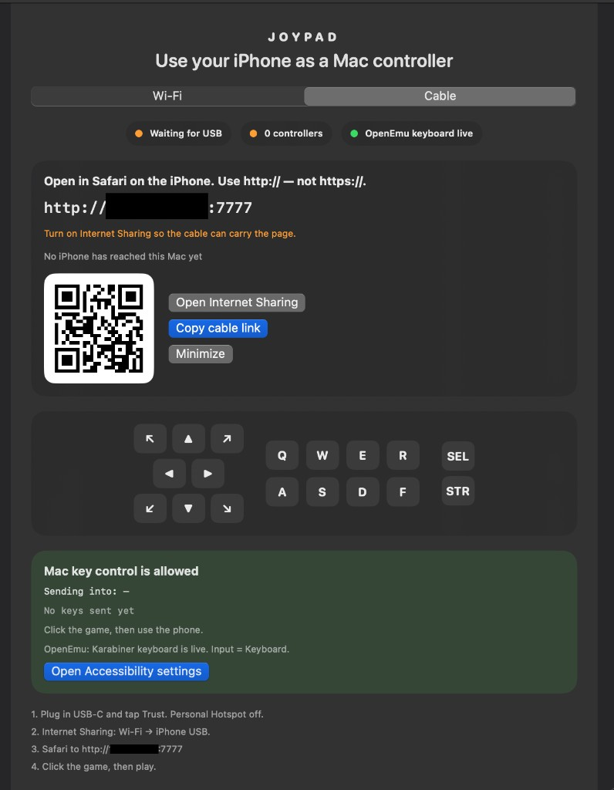
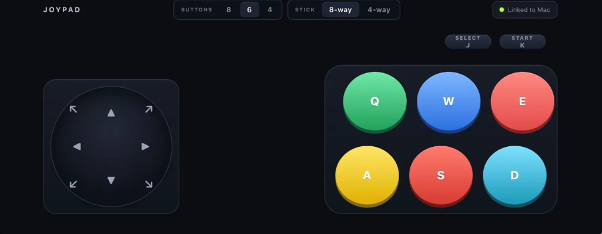

# Joypad

<p align="center">
  
</p>

Use an iPhone as a Mac gamepad. The pad is a page in Safari. The Mac app sends keys to whatever is in front.

<p align="center">
  
</p>

<p align="center">
  
</p>

| Phone | Mac |
| --- | --- |
| Stick N E S W | Arrow keys |
| Stick NE SE SW NW (8-way) | Numpad 9 3 1 7 |
| Q W E R / A S D F | Same keys |
| Select / Start | J / K |

8-way corners are their own keys, not two arrows at once. Use **Stick 4-way** if the game only wants cardinals.

## Build

```bash
./build.sh
open /Applications/Joypad.app
```

Needs macOS 14+ and Xcode Command Line Tools. The first build clones Karabiner headers into `vendor/` (not in git). After a rebuild, open `/Applications/Joypad.app` again. macOS may ask to allow the network and Accessibility.

## Use

1. Open Joypad and allow **Accessibility**.
2. **Wi‑Fi:** same network as the Mac, Personal Hotspot off. Safari to the `http://` link in the window.
3. **Cable:** plug in USB‑C, tap Trust. On the Mac, share Wi‑Fi to **iPhone USB** (Internet Sharing), then Safari to `http://192.168.2.1:7777`.
4. Click the game, then play.

Use **Safari** and `http://`. Chrome’s HTTPS-First mode hangs. Add the page to the Home Screen for a fullscreen pad.

## OpenEmu

Games ignore fake Mac keystrokes. Install [Karabiner-Elements](https://karabiner-elements.pqrs.org/), allow its system extension, then **Allow HID helper** in Joypad. Set OpenEmu **Input = Keyboard**. If the game still sees nothing, grant **Input Monitoring** to OpenEmu.

Cursor and TextEdit only need Accessibility.

## Security

The pad is on your local network. Do not port-forward port 7777. Keys go to the frontmost Mac app.

## License

[MIT](LICENSE)
